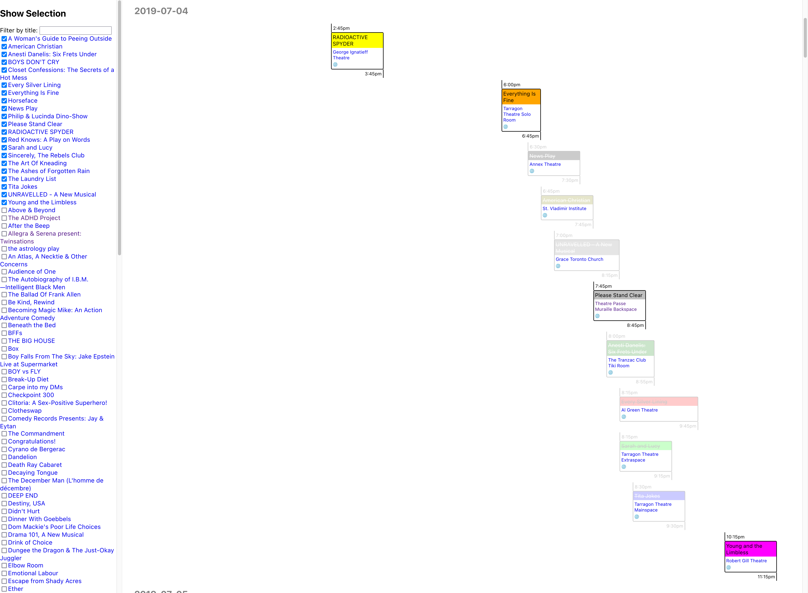

# Fringr

An easier way to Fringe more: select the shows you want to see, and get a visual planner to help you fit them all in!

https://fringr.rachlis.net

> Note: the current show data is for the [Toronto Fringe Festival](https://fringetoronto.com/fringe/about) (July 2-13, 2025).

> Disclaimer: this tool is unofficial. I am not affiliated with the Fringe Festival, I just love it. The Fringe Festival does not endorse this tool, although I heartily endorse the festival. Information may have become out of date since I gathered it. Please double check all information on the official Fringe Festival website using the provided links, before making plans.

## Contributing

This project is in a very early stage and not ready for unsolicited contributions. I have lots of plans for improvement that I haven't had time for yet, which you can see under the issue tracker. I would welcome additional feedback there, if you have an issue or idea that you don't see listed.
