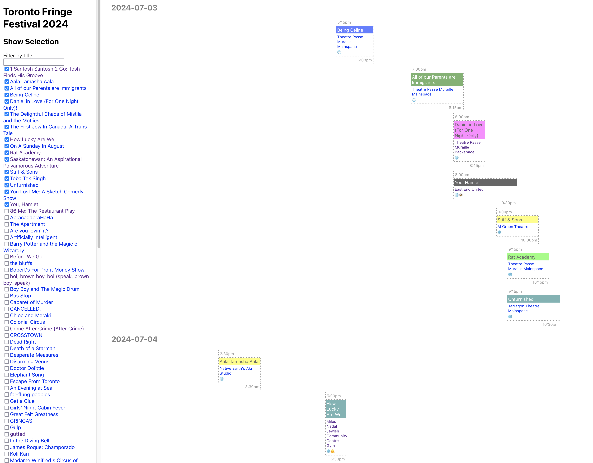

# Fringr

An easier way to Fringe more: select the shows you want to see, and get a visual planner to help you fit them all in!

https://fringr.rachlis.net

> Note: the current show data is for the [Next Stage Festival](https://fringetoronto.com/next-stage/about) (October 18-29, 2023).
>
> The next [Toronto Fringe Festival](https://fringetoronto.com/fringe/about) will be July 3-14, 2024.

Suggested workflow:

1. Select the shows you want to attend on the left.
2. Begin clicking performance times that work for you, and scrolling down the page on the right. You can see visually how much time there is between performances. Make sure to leave yourself enough travel time between venues :)
3. Keep going down the page and looking for performances with a **dashed border**. That means you have not yet selected a performance for that show. Ignore performances that are **struck-through**. That means you have already selected a performance for that show.
